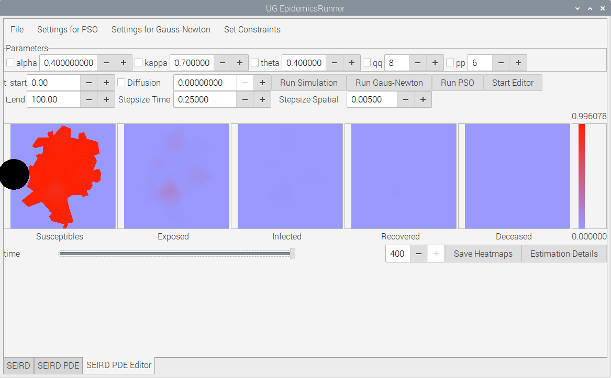
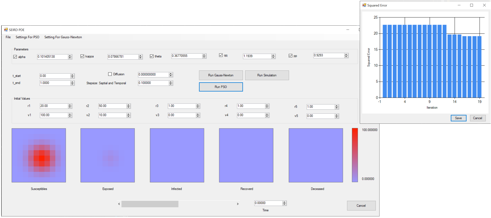
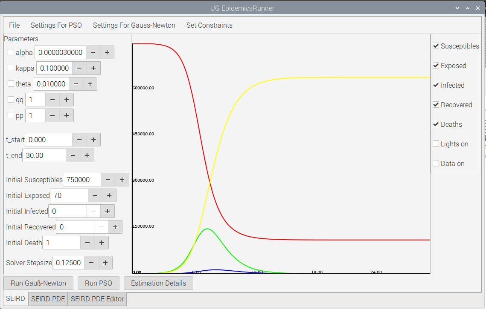

# EpidemicsRunner API #

The **EpidemicsRunner API** is a C++ library that provides various algorithms
useful for modeling infectious diseases. Amongst others, it is used by [CovPred](CovPred.de) in this exact form.

# Contents

* [Installation Notes](#installation)
* [Description](#description)

Sample problems can be found in the Samples Folder.

An optional GUI has been created for the use of estimation or prototyping. This GUI utilizes GTK and has been shown
to work on Windows, Linux and MacOS.
 
  

  
  
# Installation Notes 
## General
This library is header only.

# Description
The following algorithms are currently implemented:

|Name|Description|
|---|---|
|SIR|Classical Susceptible-Infected-Recovered-Deaths ODE Model|
|SEIRD| Extended SIR model accounting for a new class (Exposed) amongst other additions|
|SEIRD_VARA|Extended SRI model paired with variable (over time) infection rate|
|SEIRD_PDE| A PDE formulation of the SEIRD model, discretized using Finite Differences|
